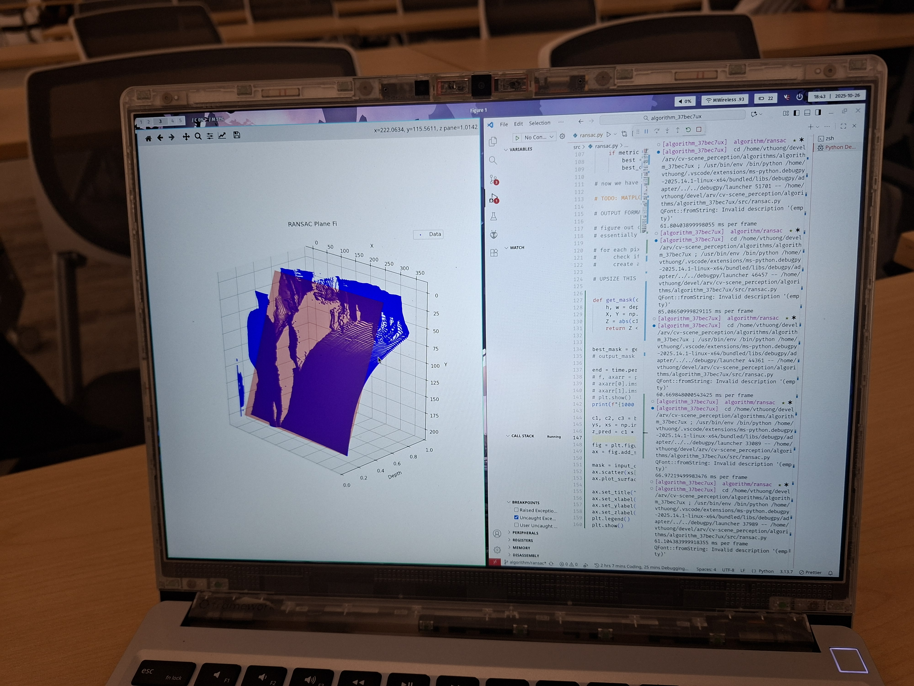
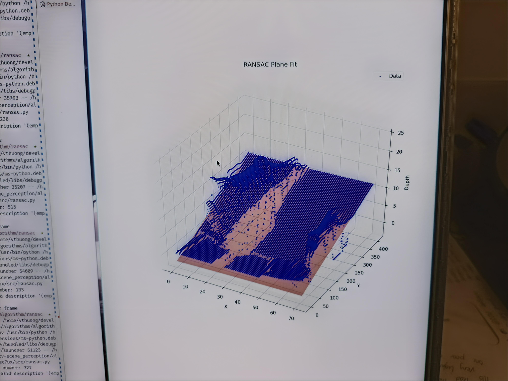
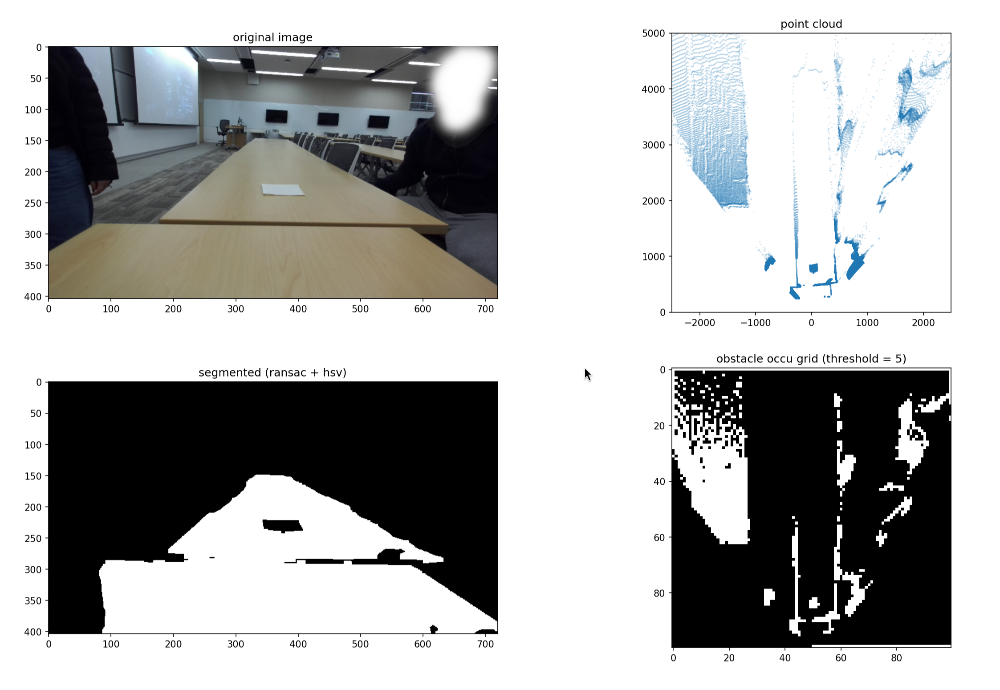

This was my first project as part of the U-M ARV club. Unlike others that I've done, the direction for this project was more or less set by the "higher-ups", so to speak. Our aim was to create an occupancy grid with sides of 5 cm which marked the driveable areas by the robot.

::github{repo="umigv/UMARV-CV-ScenePerception"}

Check the `algorithms/algorithm_37bec7ux/src/ransac` directory for the code.

## objectives

This project was motivated by needing to determine obstacles without needing to categorise them. The final deliverable would be a ROS (Robot Operating System) node to publish a matrix that represented square areas on the ground as well as if they were occupied by some obstacle.

:::note
We kind of took our sweet time. Due to various factors, we only started planning on 25-10-19, and produced the first concepts around a week later.
:::

### constraints

- 2x stereo camera system (Zed 2i)
  - RGB-D image (position, colour, and depth)
- 60 ms of compute time, made in Python

C++ would've been my language of choice, but we used Python to conform with the rest of the project. By the time we encountered performance limitations, we had too much written to justify switching to C++ and getting the accompanying environment set up (at minimum, telemetry, CMake, SDL, Eigen, OpenCV, ROS).

## goals

We first set out to simply identify the areas of the ground on the image first, and get a sense of how the depth data might be used. This process is known as image segmentation: we generate a black-and-white image which separates the areas of interest (lane lines and obstacles) and use it to locate obstacles. Here's the kind of result we wanted (and later achieved):

")

In the above picture, the white areas are the areas on the ground. We do highlight areas that are not ground at all (they cross the ground plane), but we post-process to ignore them in a later step.

## ransac

I like to just try stuff first and worry later. RANSAC (random sample consensus) was chosen because it's easy to implement, and we never saw need to change it. It's not optimal, but it's fast.

1. Repeatedly sample some points
2. Create a model for those points
3. Evaluate model's "fit" for the dataset using mean squared error

That last step is also used to determine what's part of the ground and what's not.

We use RANSAC to detect the primary flat surface in the camera view (the ground). A plane is described by $z(x,y)=ax+by+c$, so each iteration samples three datapoints (pixel location with depth).

To avoid converting every pixel into an equivalent point in 3-d space, we performed RANSAC on the image itself (pixel space). I thought this was pretty slick, but the results weren't great at first:



The blue dots are the pixels the camera sees, arranged by depth. If you hadn't guessed, the ground is not supposed to curve like that. It's curved because we tried to shortcut by using pixel space, and the math changes.

### pixel space vs. camera space

The camera space is the coordinate space in the real world in the reference frame of the camera. Though it is similar to the pixel space of the depth image, the x- and y-coordinates in camera space ($x_c$ and $y_c$) are dependent on the depth.

Imagine the line within the camera frustrum that corresponds to a pixel. Each pixel location could correspond to an infinite number of $(x_c, y_c)$ coordinates along said line. The depth value at a pixel's location determines which real coordinates are correct.

We use conversions derived from section 3 of [Focal Length and Intrinsic Camera Parameters | Baeldung on Computer Science](https://www.baeldung.com/cs/focal-length-intrinsic-camera-parameters). The relevant equations are shown below.

$$
\begin{align}
x_c&=z_c\frac{x_p-c_x}{f_x} \\
y_c&=z_c\frac{c_y-y_p}{f_y}
\end{align}
$$

Variables subscripted with $c$ are in the camera space, $p$ are in the pixel space, and the rest are camera intrinsics.

:::important
These transformations are nonlinear, as depth $z$ varies with position $(x_p, y_p)$ in the image. They cannot be modelled either; the real coordinates of the obstacle pixels are also important.
:::

### plane equation in pixel space

The nonlinear relationship mentioned above also impacts how the pixel space plane is found. If we consider the general plane equation in camera space, depth is expressed as a linear function of $x$ and $y$.

$$
ax_c+by_c+c=z_c
$$

To work in pixel coordinates, we substitute the intrinsic equations to acquire the following:

$$
az_c\frac{x_p-c_x}{f_x}+bz_c\frac{c_y-y_p}{f_y}+c=z_c
$$

Rearranged to highlight the plane coefficients:

$$
\left(-\frac{a}{cf_x}\right)x_p+\left(\frac{b}{cf_y}\right)y_p+\left(\frac{ac_x}{cf_x}-\frac{bc_y}{cf_y}+\frac{1}{c}\right)=\frac{1}{z_c} \\
$$

I was surprised to see that the pixel space coordinates were linear to $\frac{1}{z_c}$, the inverse of depth. Full credit to Edison for catching this; I had just assumed the errors we got were a hardware limitation.

In retrospect, I should've known that neat curve was not a coincidence. You can't catch everything alone, I suppose. And here is the plane fit algorithm after compensating correctly.



### pooling

Though iterative sampling is efficient, computing the error metric requires processing every single point in the image. To make this more efficient, we downsampled the depth image (a.k.a. pooling).

By averaging a rectangle region of depth values into a single pixel's depth, we work on a smaller image. The size the region determines the speed up factor, as a larger kernel creates a smaller pooled image.

:::tip
Having a large range of depth values being averaged will degrade RANSAC performance. We used a `1x16` kernel, which worked well because depth does not vary much along the x-axis.
:::

Oftentimes, the best way to optimise is to do less :upside_down_face:.

## occupancy grid

The occupancy grid is made of 50mm squares covering a 5m area in front opoints) that represents the position of every pixel in the real world. Then, we transform that cloud from the camera coordinate system to one aligned with the robot's centre using linear algebra.

Here's an example of what this conversion process looks like. The large gaps in the occupancy grid will be rectified afterward.



I've already covered how we generate the point cloud; those are the camera intrinsics equations. The remaining portion is just using appropriate rotation matrices.

Implementing this in Python actually has a lot of details that I wasn't familiar with previously, so here are some code snippets of the interesting techniques.

### python optimisations

The prevailing theme for the code in this project is the liberal application of list comprehension, C/C++ bindings and libraries. Loops in Python are extremely slow, so we avoid them wherever possible.

```python title="basic python tricks for point cloud generation"
def create_point_cloud(mask, depth_map):
    # generate coordinates from the mask image with numpy
    coords = np.argwhere(mask).astype(np.int64)   
    # swap columns with list comprehension                
    coords[:, [0, 1]] = coords[:, [1, 0]]                        
    # query the depth map with list comprehension 
    depths = depth_map[coords[:, 1], coords[:, 0]].reshape(-1, 1)
    # ... continued ...
```

Another trick was using linear algebra to reduce matrix multiplications. `cloud` is a massive matrix, so to avoid multiplying it twice by rotation matrices, we compose the two rotations before applying them.

Note: we have rotations formulated as a right-multiplication due to the point cloud matrix format.

```python title="composing matrix transformations"
def pixel_to_real(pixel_cloud, plane_coeffs, intr: Intrinsics, orientation):
    # ... convert point cloud to camera space ...

    # ... compute sine (s_1,s_2) and cosine (c_1, c_2) from plane coefficients ...

    rotate = np.array([[1.0, 0.0,  0.0],
                       [0.0, c_1, -s_1],
                       [0.0, s_1,  c_1]]).transpose()
    rotate = rotate @ np.array([[c_2, 0.0, -s_2],
                                [0.0, 1.0,  0.0],
                                [s_2, 0.0,  c_2]]).transpose()

    return cloud @ rotate
```

Then, we have to figure out the cells with obstacles and cells that are driveable. For this, we used a nice trick involving `np.bincount()` because even list comprehension was too slow.

```python title="binning the point cloud"
def occupancy_grid(real_pc: npt.NDArray, conf: GridConfiguration):
    # compute occupancy grid size
    width = conf.gw // conf.cw
    height = conf.gh // conf.cw

    real_pc = real_pc[:, (0, 2)] # ignore y-axis (height)
  
    # turn coordinates into indices
    real_pc = real_pc.astype(np.int16)
    real_pc[:, 0] = width // 2 + (real_pc[:, 0] // conf.cw)
    real_pc[:, 1] = height - 1 - (real_pc[:, 1] // conf.cw)
    real_pc = constrain(real_pc, width, height)

    # create array of point counts in each cell
    cnt = np.bincount(real_pc[:, 1] * width + real_pc[:, 0])
    cnt = np.resize(cnt, (height, width))

    return cnt >= conf.thres # require a minimum of points to fill a cell
```

### line-of-sight interpolation

TODO:
explain why we need to compute all of the points and not just the visible cells
draw diagram of known/unknown, ground/obstacle split

#### jit optimisation

We first used `skimage.draw.line()` from `scikit-image` to draw lines on the occupancy grid, but we found (using the profiler `snakeviz`) that it was too slow. This is probably due to the library's Cython code.

We replaced their code with JIT (just-in-time compilation) variant, reducing computation time from 20ms to 3ms.

```python title="using jit optimisation"
from numba import njit

@njit(cache=True)
def _trace_and_fill(occ, i0, j0, i1, j1):
  # perform bresenham walk from (i0, j0) to (i1, j1)
  # fill gaps with the last known state (obstacle or ground)

def create_los_grid(occ, cameras):
    occ = occ.astype(np.uint8)

    for cam in cameras:
        # identify where camera fov hits occupancy grid border

        idx, jdx = [], []
        # fill arrays with points along grid border within fov

        # assume no obstacles between robot and nearest pixel seen
        occ[cam.i, cam.j] = 255

        # interpolate
        for end_i, end_j in zip(idx, jdx):
            _trace_and_fill(occ, cam.i, cam.j, end_i, end_j)

    return occ
```

## merging two cameras

notes:

- since we are already so slow, we don't want to run a merging algorithm like iterative closest point
-
