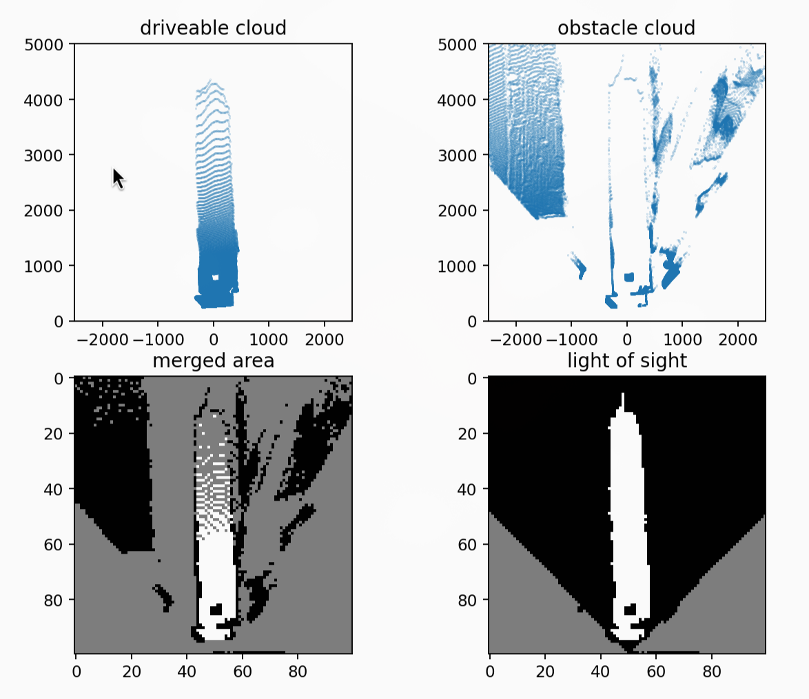

This was my first project as part of the U-M ARV club. Unlike others that I've done, the direction for this project was more or less set by the "higher-ups", so to speak. Our aim was to create an occupancy grid with sides of 5 cm which marked the driveable areas by the robot.

As of 2026-02-27, this project is still ongoing (though nearing completion). Because the state of camera merging is not truly finalised, I'll only talk about creating an occupancy grid from one camera's output here.

::github{repo="umigv/UMARV-CV-ScenePerception"}

Code for this project can be found in the above repository, in the `algorithms/algorithm_37bec7ux/src/ransac` directory.

## project context

This project was motivated by needing to determine obstacles without needing to categorise them using AI. The final deliverable would be a ROS (Robot Operating System) node to publish a matrix that represented square areas on the ground as well as if they were occupied by some obstacle.

### constraints

- 2x stereo camera system (Zed 2i)
  - RGB-D image (position, colour, and depth)
- 60 ms of compute time, made in Python

C++ would've been my language of choice, but we used Python to conform with the rest of the project. By the time we encountered performance limitations, we had too much written to justify switching to C++ and getting the accompanying environment set up (at minimum, telemetry, CMake, SDL, Eigen, OpenCV, ROS).

## initial approach

We first set out to simply identify the areas of the ground on the image first, and get a sense of how the depth data might be used. This process is known as image segmentation: we generate a black-and-white image which separates the areas of interest (lane lines and obstacles) and use it to locate obstacles. Here's the kind of result we wanted:

")

In the above picture, the white areas are the areas on the ground. We do highlight areas that are not ground at all (they cross the ground plane), but we post-process to ignore them in a later step.

## ransac

I like to just try stuff first and worry later. RANSAC (random sample consensus) was chosen because it's easy to implement, and we never saw need to change it.

1. Repeatedly sample some points
2. Create a model for those points
3. Evaluate model's "fit" for the dataset using mean squared error

That last step is also used to determine which pixels are part of the ground (the inliers).

We use RANSAC to detect the primary flat surface in the camera view. A plane is described by $z(x,y)=ax+by+c$, so each iteration samples three data points (pixel location with depth).

To avoid converting every pixel into an equivalent point in 3-d space, we performed RANSAC on the image itself (pixel space). I thought this was pretty slick, but the results weren't great at first:


The blue dots are the pixels the camera sees, arranged by depth. If you hadn't guessed, the ground is not supposed to curve like that. It's curved because we tried to shortcut by using pixel space, and the math changes.

### pixel space vs. camera space

The camera space is the coordinate space in the real world in the reference frame of the camera. Though it is similar to the pixel space of the depth image, the x- and y-coordinates in camera space ($x_c$ and $y_c$) are dependent on the depth.

Imagine the line within the camera frustrum that corresponds to a pixel. Each pixel location could correspond to an infinite number of $(x_c, y_c)$ coordinates along said line. The depth value at a pixel's location determines which real coordinates are correct.

We use conversions derived from section 3 of [Focal Length and Intrinsic Camera Parameters | Baeldung on Computer Science](https://www.baeldung.com/cs/focal-length-intrinsic-camera-parameters). The relevant equations are shown below.

$$
\begin{align}
x_c&=z_c\frac{x_p-c_x}{f_x} \\
y_c&=z_c\frac{c_y-y_p}{f_y}
\end{align}
$$

Variables subscripted with $c$ are in the camera space, $p$ are in the pixel space, and the rest are camera intrinsics.

:::important
These transformations are nonlinear, as depth $z$ varies with position $(x_p, y_p)$ in the image. They cannot be modelled either; the real coordinates of the obstacle pixels are also important.
:::

### plane equation in pixel space

The nonlinear relationship mentioned above also impacts how the pixel space plane is found. If we consider the general plane equation in camera space, depth is expressed as a linear function of $x$ and $y$.

$$
ax_c+by_c+c=z_c
$$

To work in pixel coordinates, we substitute the intrinsic equations to acquire the following:

$$
az_c\frac{x_p-c_x}{f_x}+bz_c\frac{c_y-y_p}{f_y}+c=z_c
$$

Rearranged to highlight the plane coefficients:

$$
\left(-\frac{a}{cf_x}\right)x_p+\left(\frac{b}{cf_y}\right)y_p+\left(\frac{ac_x}{cf_x}-\frac{bc_y}{cf_y}+\frac{1}{c}\right)=\frac{1}{z_c} \\
$$

I was surprised to see that the pixel space coordinates were linear to $\frac{1}{z_c}$, the inverse of depth. Full credit to Edison for catching this; I had just assumed the errors we got were a hardware limitation.

In retrospect, I should've known that neat curve was not a coincidence. You can't catch everything alone, I suppose. And here is the plane fit algorithm after compensating correctly:


Generating the mask is pretty simple after this point (pixels less than `thres` from the plane are white). The final mask has been shown [earlier](#initial-approach) so I won't duplicate it here.

### pooling

Though iterative sampling is efficient, computing the error metric requires processing every single point in the image. To make this more efficient, we downsampled the depth image (a.k.a. pooling).

This is down by averaging a rectangular region of depth values into a single pixel's depth, creating a smaller image. The size of that region determines the speed up factor; a larger kernel creates a smaller pooled image.

:::info
Having a large range of depth values being averaged will degrade RANSAC performance. We used a `1x16` kernel, which worked well because depth does not vary much along the x-axis.
:::

Oftentimes, the best way to optimise is to do less :upside_down_face:.

## occupancy grid

The occupancy grid is made of 50 mm squares covering a 25 sqm area in front of the robot. It is populated by mapping every pixel to its corresponding location in 3-d space. Then, we transform that cloud from the camera coordinate system to one aligned with the robot's centre using linear algebra.

:::note
**Doesn't this approach defeat the purpose of RANSAC in pixel space?**

Well, yes. I had initially planned to use an image-warping transformation to create the grid, which would not require the point cloud (and hence the reason I tried to avoid creating them). However, I got this approach working first and so stuck with it.
:::

Here's an example of what this conversion process looks like. The large gaps in the occupancy grid will be rectified afterward.


I've already covered how we generate the point cloud; those are the camera intrinsics equations. The remaining portion is just using appropriate rotation matrices based on the angle between the camera and the ground (which is found using the ground plane model).

Implementing this in Python actually has a lot of details that I wasn't familiar with previously, so here are some code snippets of the interesting techniques.

### python optimisations

The prevailing theme for the code in this project is the liberal application of list comprehension, C/C++ bindings and libraries. Loops in Python are extremely slow, so we avoid them wherever possible.

```python title="basic python tricks for point cloud generation"
def create_point_cloud(mask, depth_map):
    # generate coordinates from the mask image with numpy
    coords = np.argwhere(mask).astype(np.int64)   
    # swap columns with list comprehension                
    coords[:, [0, 1]] = coords[:, [1, 0]]                        
    # query the depth map with list comprehension 
    depths = depth_map[coords[:, 1], coords[:, 0]].reshape(-1, 1)
    # ... continued ...
```

Another trick was using linear algebra to reduce matrix multiplications. `cloud` is a massive matrix, so to avoid multiplying it twice by rotation matrices, we compose the two rotations before applying them.

Note: we have rotations formulated as a right-multiplication due to the point cloud matrix format.

```python title="composing matrix transformations"
def pixel_to_real(pixel_cloud, plane_coeffs, intr: Intrinsics, orientation):
    # ... convert point cloud to camera space ...

    # ... compute sine (s_1,s_2) and cosine (c_1, c_2) from plane coefficients ...

    rotate = np.array([[1.0, 0.0,  0.0],
                       [0.0, c_1, -s_1],
                       [0.0, s_1,  c_1]]).transpose()
    rotate = rotate @ np.array([[c_2, 0.0, -s_2],
                                [0.0, 1.0,  0.0],
                                [s_2, 0.0,  c_2]]).transpose()

    return cloud @ rotate
```

Finally, we have to figure out the cells with obstacles and cells that are driveable. For this, we used a nice trick involving `np.bincount()` because even list comprehension was too slow.

```python title="binning the point cloud"
def occupancy_grid(real_pc: npt.NDArray, conf: GridConfiguration):
    # compute occupancy grid size
    width = conf.gw // conf.cw
    height = conf.gh // conf.cw

    real_pc = real_pc[:, (0, 2)] # ignore y-axis (height)
  
    # turn coordinates into indices
    real_pc = real_pc.astype(np.int16)
    real_pc[:, 0] = width // 2 + (real_pc[:, 0] // conf.cw)
    real_pc[:, 1] = height - 1 - (real_pc[:, 1] // conf.cw)
    real_pc = constrain(real_pc, width, height)

    # create array of point counts in each cell
    cnt = np.bincount(real_pc[:, 1] * width + real_pc[:, 0])
    cnt = np.resize(cnt, (height, width))

    return cnt >= conf.thres # require a minimum of points to fill a cell
```

## line-of-sight interpolation

However, the occupancy grid is not complete. There are many cells on the grid, like the cells further away, that will not have any points inside them, like in the below example. We have to infer their state.



As the name suggests, our guess is based on a line of sight to the camera. We step along lines originating from the camera (middle of the bottom edge) to all of the points along the edge that it can see.

Every grey cell (unknown state) turns white (driveable) if it is reached after first reaching a driveable cell, and black (obstacle) if it is reached after a blocked cell.

The result of line-of-sight interpolation is shown above in the bottom-right corner.

:::tip
In retrospect, it would be smarter to make the occupancy grid in inverse, mapping cells on the grid to areas on the image mask instead. This approach would eliminate the need to go back in and fill the gaps, because no gaps can exist.
:::

### jit optimisation

We first used `skimage.draw.line()` from `scikit-image` to draw lines on the occupancy grid, but we found (using the profiler `snakeviz`) that it was too slow. This is probably due to the library's Cython code.

By replacing that line-drawing with a JITed (just-in-time compiled) variant, we achieved a 7x speedup (from 20ms to 3ms).

```python title="using jit optimisation"
from numba import njit

@njit(cache=True)
def _trace_and_fill(occ, i0, j0, i1, j1):
  # perform bresenham walk from (i0, j0) to (i1, j1)
  # fill gaps with the last known state (obstacle or ground)

def create_los_grid(occ, cameras):
    occ = occ.astype(np.uint8)

    for cam in cameras:
        # identify where camera fov hits occupancy grid border

        idx, jdx = [], []
        # fill arrays with points along grid border within fov

        # assume no obstacles between robot and nearest pixel seen
        occ[cam.i, cam.j] = 255

        # interpolate
        for end_i, end_j in zip(idx, jdx):
            _trace_and_fill(occ, cam.i, cam.j, end_i, end_j)

    return occ
```

## summary

Getting to a birds-eye representation of the surroundings requires quite a few steps. From an RGB-D image, we:

1. create a plane model in $(x_p, y_p, z_c^{-1})$ using RANSAC
2. generate a point cloud of the surroundings using the plane model and camera intrinsics
3. transform the point cloud to align it with the robot's direction
4. bin the points into the occupancy grid cells
5. line-of-sight is used to fill in any remaining gaps

, the mask (top-right), the point clouds (middle row), the raw grid (bottom-left), and the interpolated output (bottom-right)")

Performance is not stellar (likely because I've never used Python to write performant code before) but is passable. The full pipeline processes a frame with 100 iterations in 20-25 ms.

### credits

- joshua kin: co-wrote the first ransac prototype and visualisation
- edison zhou: identified the error in the simple plane model
- ryan liao: helped optimise python code

## closing thoughts

I'm well aware that our algorithm is not particularly efficient or elegant. I think the masking process is well-designed, but the parts involving the generation of the occupancy grid definitely use a lot of compute to do what can be achieved with a homography or a clever bilinear interpolation.

I am still reasonably proud of the results we have seen, though, and will definitely keep working on this vision pipeline. Depth vision definitely performed better than obstacle detection based on a model like YOLO, since it works with unknown objects too.

Working with the ARV team has been a pleasure, and I think it has definitely increased my appreciation for collaborative projects. The upper-level students have been excellent mentors, and their trust and support have been no small part of why I was able to find success with this original design.
